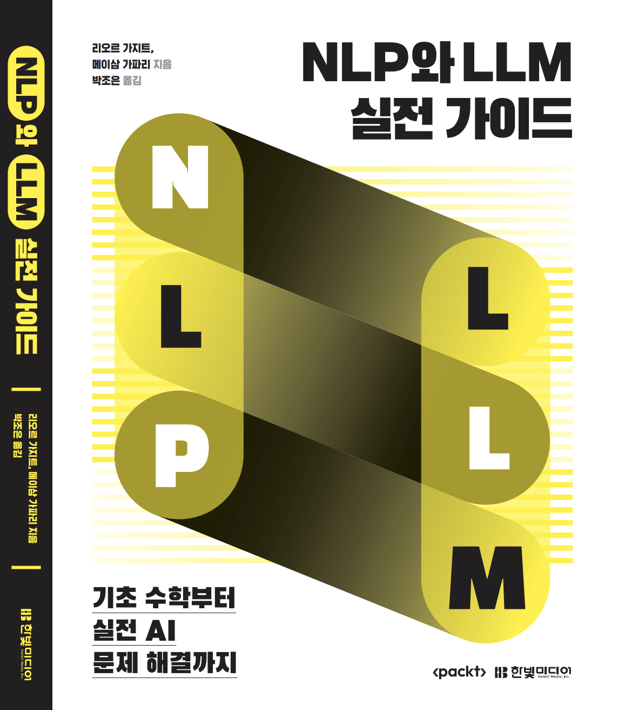

# NLP와 LLM 실전 가이드

다음 도서의 한국어 번역서 입니다.
* [Mastering NLP from Foundations to LLMs: Apply advanced rule-based techniques to LLMs and solve real-world business problems using Python: Lior Gazit, Meysam Ghaffari: 9781804619186: Amazon.com: Books](https://www.amazon.com/Mastering-NLP-Foundations-LLMs-Techniques/dp/1804619183/)

* ☀️ 한빛미디어 홈페이지: https://www.hanbit.co.kr/store/books/look.php?p_code=B9369633154
* 🚀 쿠팡 : https://link.coupang.com/a/ch090Z
* 📚 교보문고: https://product.kyobobook.co.kr/detail/S000215892769
* 📖 예스24: https://www.yes24.com/Product/Goods/142954897
* 🪔  알라딘: https://www.aladin.co.kr/shop/wproduct.aspx?ItemId=358930221
---

### **Chapter 4**  

- **Ch4_NER_and_POS.ipynb** :   

- **Ch4_Preprocessing_Pipeline.ipynb** :   

---

### **Chapter 5**  

- **Ch5_Text_Classification_Traditional_ML.ipynb** :   

---

### **Chapter 6**  

- **Ch6_Text_Classification_DL.ipynb** :   

---

### **Chapter 8**  

- **Ch8_Setting_Up_Close_Source_and_Open_Source_LLMs.ipynb** :   

- **Ch8_Setting_Up_LangChain_Configurations_and_Pipeline.ipynb** :   

---

### **Chapter 9**  

- **Ch9_Advanced_LangChain_Configurations_and_Pipeline.ipynb** :   

- **Ch9_Advanced_Methods_with_Chains.ipynb** :   

- **Ch9_Completing_a_Complex_Analysis_with_a_Team_of_LLM_Agents.ipynb** :   

- **Ch9_RAGLlamaIndex_Prompt_Compression.ipynb** :   

- **Ch9_Retrieve_Content_from_a_YouTube_Video_and_Summarize.ipynb** :   
